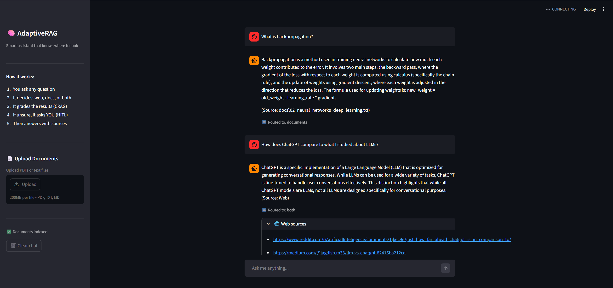

🧠 AdaptiveRAG — Intelligent Query Routing Agent
Show Image
Show Image
Show Image
Show Image
Show Image
A smart AI assistant that thinks before answering. It figures out whether to search the web, your documents, or both — then grades the results before responding.

📸 Screenshots

✨ Features

Query routing — automatically decides: web, documents, or both
CRAG — grades retrieved results before generating an answer
HITL — graph pauses and asks you when it's unsure
Hybrid search — BM25 + vector search on your documents
LangSmith tracing — every step traced end-to-end
Document upload — upload your own PDFs or text files

🛠️ Tech Stack

Agent: LangGraph
LLM: OpenAI GPT-4o-mini
Web search: Tavily API
Vector DB: ChromaDB
Tracing: LangSmith
UI: Streamlit

🚀 How to Run
bash# 1. Clone and install
git clone https://github.com/Sidthak/adaptiverag.git
cd adaptiverag
python -m venv venv
venv\Scripts\activate
pip install -r requirements.txt

# 2. Create .env file
OPENAI_API_KEY=your-key
TAVILY_API_KEY=your-key
LANGCHAIN_API_KEY=your-key
LANGCHAIN_TRACING_V2=true
LANGCHAIN_PROJECT=adaptiverag

# 3. Add documents (optional)
python ingest.py

# 4. Run
streamlit run app.py --server.fileWatcherType none

Built by Sidhant Thakur